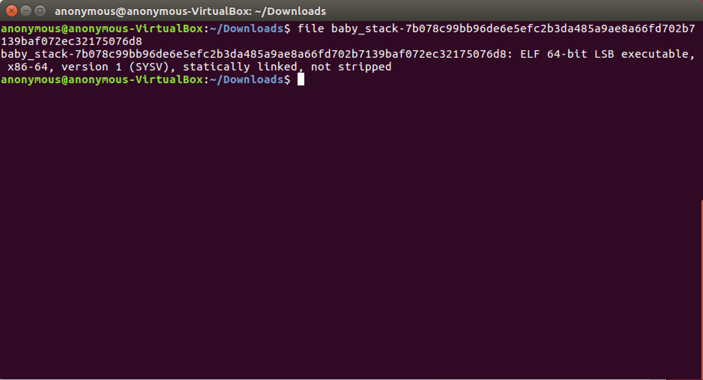
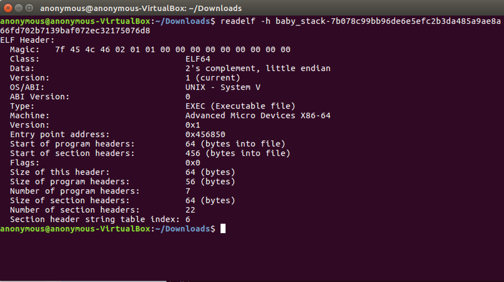
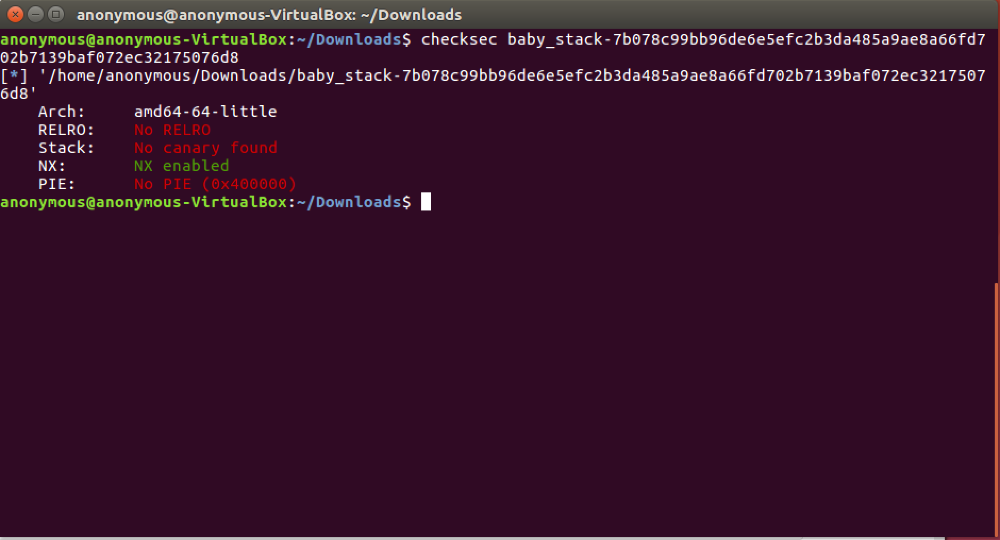
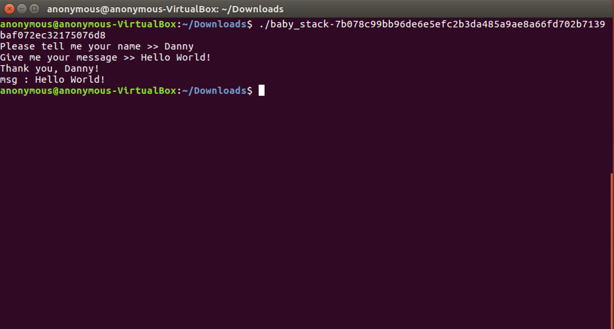
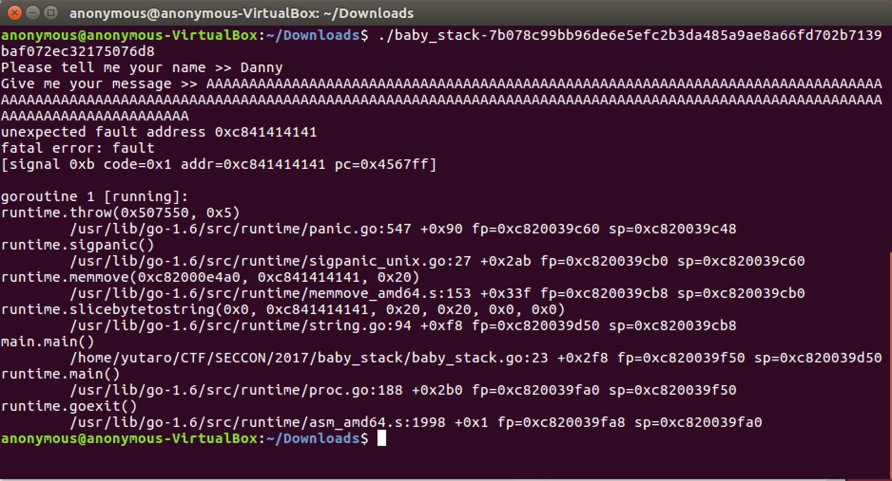
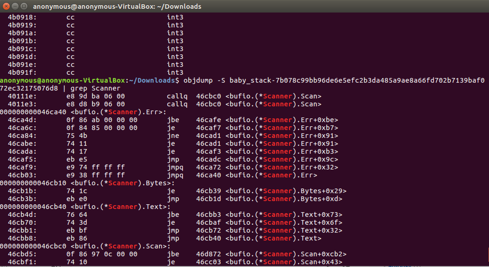
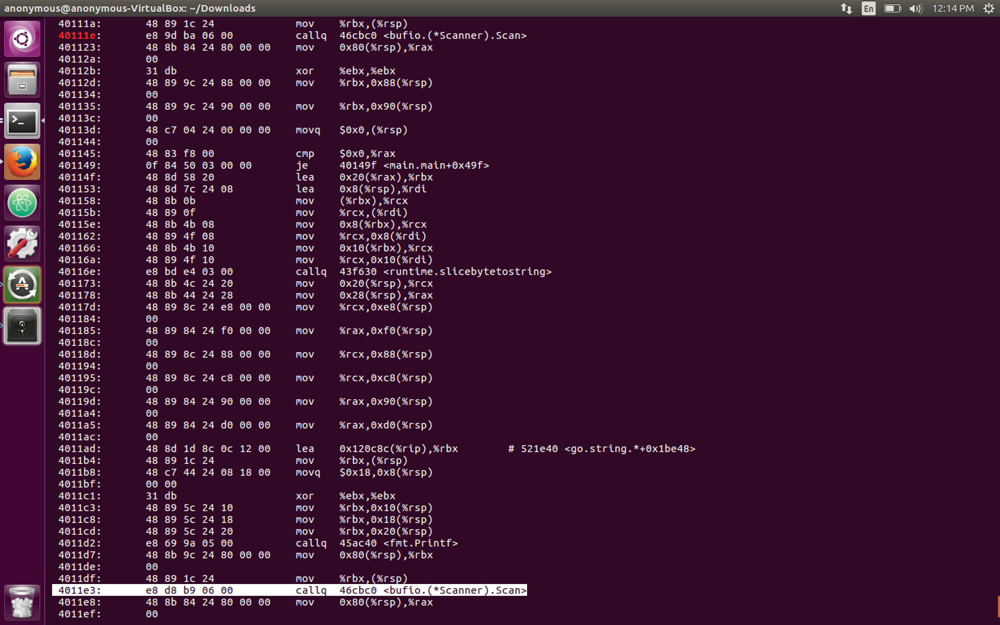
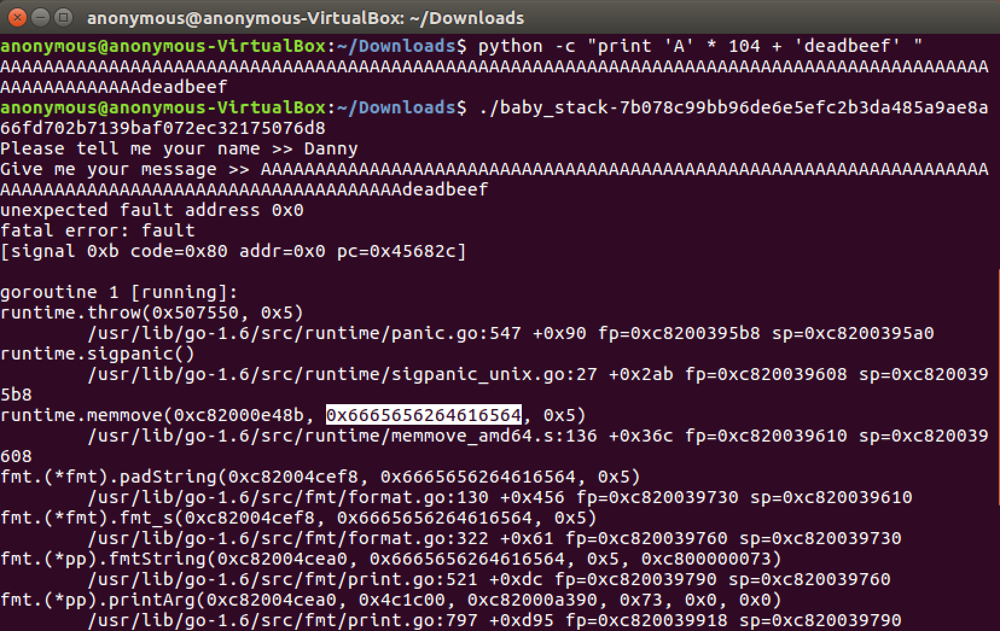
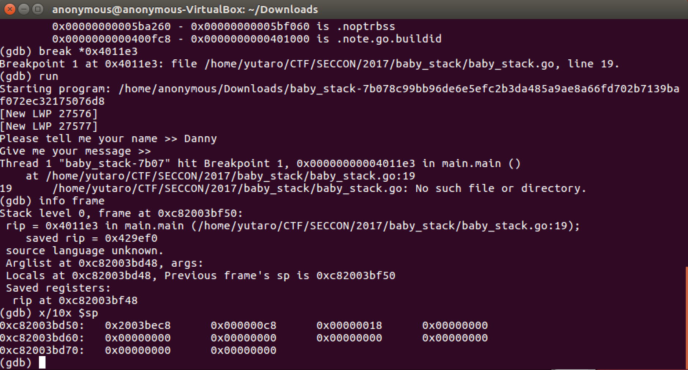

# Smashing the Stack
## Stack Based Buffer Overflow Part 1

Part 2 is building the ROP chain to control execution and invoke a shell (coming soon). 

I wanted to make a relatively quick and easy educational guide to exploiting x64 ELF executables (**using free and opensource tools**). Specifically the process I go through when reversing and testing executables. I chose to use SECCON 2017 CTF's Baby Stack challenge because it incorporated a good buffer overflow example and provided the ability to chain ROP gadgets to complete the exploit. But this tutorial is really about the process and techniques used to achieve execution control, so hopefully you can recreate it in any environment.

There have been several really good write-ups on this challenge already (specifically TeamRocketIST) but most of them required some sort of commercial software that students, like myself don't usually have the funds for. So I made this in the hopes that other students can get started without the upfront cost of commercial software.

So lets get started!

Tools used in this demo: 
  * Linux Ubuntu VM (this really doesn't matter, pick any OS you're comfortable in)
  * [pwntools](https://github.com/Gallopsled/pwntools.git) - Really useful python library for exploit dev 
  * GDB - Debugger
  * objdump - Binary Utility 

Before we get started make sure you download the CTF file [baby_stack](baby_stack-7b078c99bb96de6e5efc2b3da485a9ae8a66fd702b7139baf072ec32175076d8.dms) and make it executable

The first thing I always do when I'm testing a file is see what kind of file it is. Here's a sample of what that looks like for our test file:

So now we know it's a statically linked (meaning we can't jump into libc since they are embedded in the binary) 64-bit ELF executable and we can run the readelf command and the checksec command (if you get an error be sure to install the pwntools library above) to gain even more insight on the file. The output was:

 

Now we have the entry address (from readelf) which could come in handy in the future. And more importantly we know that stack canary is disabled (yay!) and NX is enabled which stands for non-executable segment. It means that the application, when loaded in memory, does not allow any of it's segments to be both writable and executable (hence why we need ROP in Part 2, we will come back to this later).

Next let's try running it and see what it actually does:

Nothing too exciting. It looks like it's just taking in two inputs and simply reformatting and printing them. So let's try inputting a longer buffer and see what happens. These were the results:

So you can see we have a go routine (GO executable) and were able to overflow the buffer but if you read the stack trace we see we get a segmentation fault but we aren't getting it because we are successfully replacing the return address (0xc841414141). It's actually because we are changing the parameters of the memmove() function which changes the paramters for the print function. 

At this point we want to dissasemble the executable and see if we can find the scanner bufio function calls (where the program asks for user input) and better understand the flow of execution. This is where most commercial dissasmblers come in handy to be able to quickly find these points of input but we're going to use objdump with the -S (source) flag and combine it with grep to find the things we need. This is how it should look (note this took me a few trial and error searches but in the end did just as well as IDAPro in my opinion): 

First we grep for keyword Scanner and the first two hits are the function calls we need (how convienent). For me, those were at 40111e and 4011e3. We then use objdump again to find them in the main function here: 

Using that information we can set a break point at the first printf function and learn (with the help of some testing) that the padding needed to reach the first input paramter is 104. You can see this in action here (we use python to generate 104 A's and see the memmove() now contains our payload deadbeef): 

*Note: Look at the next step if you need help with setting breakpoints and analyzing the stack because you will need to do it to find the other padding*

Now let's also use those function addresses to set break points and analyze the registers and stack at those breakpoints. Let's set a breakpoint at the second input function and analyze the stack:

We can use one of the addresses after the x/10x $sp command as our return point of execution (for example I use - 0xc82003bd60) and begin writing our exploit. To do that we use the pwntools library as well as all the useful information we gathered thus far: 

When we run it we get: 

As you can see this is a similar result to when we overflow the memcopy() function and change the print function parameters. This is because we still have to calculate the amount of padding to the next printf function and do the same thing again to be able to overwrite the return address (I used objdump and gdb to calculate the second and third padding values the same way we did with the first one).

